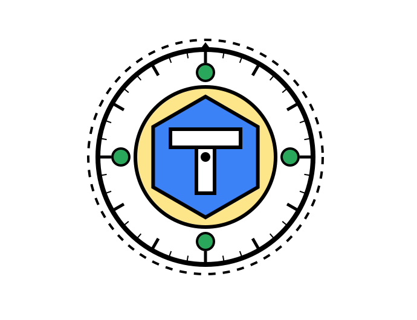

<div align="center">
  
  <h1>TokenVault</h1>
  <p><strong>A Brutalist Dashboard for Tracking Antigravity AI Account Tokens</strong></p>
  <p>
    
    
    
    
  </p>
</div>

---

## ⚡ What is TokenVault?

TokenVault is a highly responsive, securely authenticated dashboard designed to track **Antigravity AI token refresh cooldowns** across all 6 flagship models. Never wonder when your API quota resets again.

Built with a stunning **Akademia Brutalist** aesthetic—featuring high-contrast borders, sharp offset shadows, and vibrant geometric accents—TokenVault is as fast as it is beautiful.

---

## ✨ Features

- **⏱️ Live Countdowns:** Second-by-second countdowns for your token refresh limits.
- **🔐 Google OAuth Integration:** Secure, seamless login using NextAuth v5.
- **🎨 Akademia Brutalist UI:** Hand-crafted, responsive layout with stark black borders, pill-shaped UI elements, and custom SVG iconography.
- **🗄️ MongoDB Persistence:** All your accounts, user data, and cooldown timestamps are securely scoped to your email address and backed up in MongoDB Atlas.
- **⚡ Edge Protected Routes:** Blazing fast middleware (`proxy.js`) prevents unauthenticated access to the dashboard and APIs before the page even renders.
- **📱 Fully Responsive:** Carefully tailored layout that gracefully collapses from wide desktop views to compact mobile screens.
- **🔎 Instant Filtering:** Instantly filter your tracked accounts by email, nickname, or by when they next return (e.g., `< 1 Day`).

---

## 🚀 Quick Start

### 1. Clone & Install
```bash
git clone https://github.com/your-username/tokenvault.git
cd tokenvault
npm install
```

### 2. Environment Variables
Create a `.env.local` file in the root directory and add the following keys. (Use `.env.local.example` as a template):

```env
MONGODB_URI=mongodb+srv://<username>:<password>@cluster0.mongodb.net/tokenvault
AUTH_SECRET=your_super_secret_auth_string

# Google OAuth Credentials
AUTH_GOOGLE_ID=your_google_client_id.apps.googleusercontent.com
AUTH_GOOGLE_SECRET=your_google_client_secret
```

### 3. Run the Development Server
```bash
npm run dev
```

Open [http://localhost:3000](http://localhost:3000) with your browser to see the result.

---

## 🧠 Tech Stack Deep Dive

- **Framework:** Next.js 16 (App Router)
- **Database:** MongoDB (via Mongoose)
- **Authentication:** Auth.js / NextAuth.js v5 (Google Provider)
- **Styling:** Tailwind CSS + custom CSS (`globals.css` for brutalist utilities)
- **Animation:** Framer Motion
- **Icons:** Lucide React
- **Components:** Radix UI (Tooltips, Dropdown Menus, Dialogs)

---

## 🎨 The "Akademia" Design Language
TokenVault uses a custom design system inspired by Neo-Brutalism:
- **Colors:** Deep Black (`#000`), Pure White (`#FFF`), Kelly Green (`#29A85C`), Primary Blue (`#3B82F6`), Bright Yellow (`#FDE68A`), and a soft warm off-white background (`#F4F4F1`).
- **Typography:** `Plus Jakarta Sans` for bold, legible headings and `Space Mono` for crisp countdown numbers.
- **Shadows:** Hard, solid `4px` and `6px` offset shadows without blur (`rgba(0,0,0,1)`).

---

<div align="center">
  <p><i>Built with 🖤 by Vishvam Trivedi & Antigravity</i></p>
</div>
